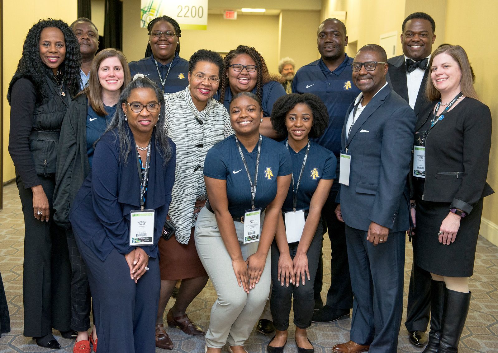
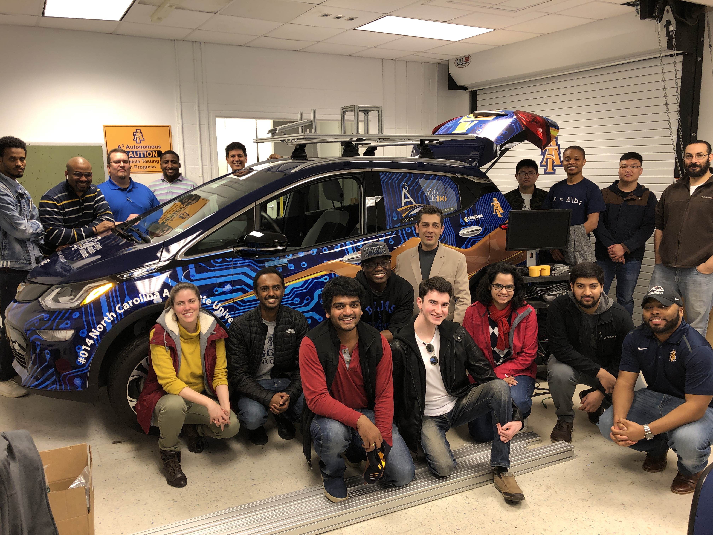

### <i class="fa fa-fw fa-user-graduate" aria-hidden="true"></i> Undergraduate Research Mentorship

 

Deciding to go to graduate school is a big decision. One thing that helped me make the decision was the opportunity to partake in undergraduate research. Now a professor, I am happy to have the chance to pay that experience forward. Refer to the student tab for more information about current openings.

## The Awesome Undergrads I've Have/Had the Pleasure of Working With

* **\[current\] Mrs. Joelle Banks** is working on an empirical study for semantic-based program repair. Projected graduate: Spring 2020.

## Undergraduate Mentorships
* **AMIE Design Challenge at BEYA 2019:** Mentoring 6 undergraduate students as they develop a student-led solution for a student identified problem in the healthcare sector. If you are attending BEYA 2019, come check out the remarkable work these students designed and prototyped. (Industry sponsor: NetApp).

* **AutoDrive Challenge:** Mentoring 3 undergraduate students across the mapping and functional safety challenges. The AutoDrive challenge is an applied research project where the students gradually work towards building a self-driving car over a 3 year time period. This experience exposes undergraduate students to graduate students, industry collaboration, and the bridge between industry and research.

---

### <i class="fa fa-fw fa-chalkboard-teacher" aria-hidden="true"></i> Undergraduate Education and Curriculum

I'll let you know a trade secret about professors: we do not have to take any training related to teaching. However, undergraduate education is our chance to make the largest impact on our field, because we get the opportunity to build up all our students into productive members of the computer science community (*and that is something that touches more lives than our research ever can -- well, for most of us this is true*). Additionally, most undergraduate students pay out-of-pocket for their education, causing them to go into debt or have a 6 to 8 year bachelors path. Therefore, I am dedicated to delivering quality undergraduate education. I want my students walking out of my classroom feeling empowered and prepared for the future. I do not want them thinking it was a waste of time or that the only value they gain is the credentials for a job. I am constantly consulting with other professors to learn what did and did not work in their classrooms, and I am always looking for industry engagement in course design.

## Professional Development 
* **\[Summer 2019\] Google FIR:** FIR is an immersive professional development program that engages CS faculty serving underrepresented populations in tech.  Our focus is on industry-informed, applied learning projects. 
* **\[Fall 2018\] Re-designed Comp 285:** I co-designed my "Comp 285: Design and Analysis of Algorithms" course with one of my PhD committee members, Dr. Julien from the University of Texas at Austin.
* **\[August 2018\] Facebook's T3 Faculty Summit** dedicated to developing Data Structures and Algorithms curriculum.

---

### <i class="fa fa-fw fa-school" aria-hidden="true"></i> K-12 Outreach

Often, we follow the career paths of the people around us. As a result, many people enter STEM fields such as electrical engineering because they have a close family member in that field. Furthermore, most high schools do not expose students to the diverse array of STEM majors 
(*you are often lucky if you have a computer science class offered let alone a mechanical or electrical engineering course*).This is why STEM outreach is so important. I am eager to share the STEMS field with k-12 students, and make them aware of STEM majors as a possible career path.

## Activities
* **Triad Programming Contest:** I am a organizer and judge for the Triad Programming Contest, hosted by NC A&T State University. The contest was open to both highschool and colleges in the greated Triad area.
* **FIRST LEGO League State Championships volunteer:** On February 2nd and 3rd, approximately 900 4th through 8th grade students from across the state of North Carolina will come to NC A&T campus to compete at the FIRST LEGO League (FLL) State Championships.
