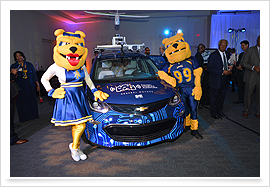

Here, I provide a highlight view of some current projects; for more information, please read some of my papers, or contact me directly.

### <i class="fa fa-fw fa-code-branch" aria-hidden="true"></i> Tools

I am interested in applied research, and the efforts to transition research ideas into real tools to be used by the software development community.

  * **[Seabs:](https://github.com/Allisonius/Seabs)** Tool to allow the user to guide solution enumeration for an Alloy model using abstract functions.
  * **[AUnit Analyzer:](https://sites.google.com/view/aunitanalyzer)** Extension to the Alloy Analyzer that provides support for AUnit (test creation, test execution, coverage).
  * **[MuAlloy:](https://github.com/kaiyuanw/MuAlloy)** Mutation testing tool for Alloy 
  * **[ASketch:](https://github.com/kaiyuanw/ASketch)** Tool to synthesize parts of an Alloy model using sketching.
  * **[ARepair:](https://github.com/kaiyuanw/ARepair)** Tool for automated repair of Alloy models. The tool firsts performs fault localization to narrow in on the buggy portion of the model, then uses synthesis techniques to fix the model.
  
### <i class="fa fa-fw fa-cogs" aria-hidden="true"></i> Research Projects

## <i class="fa fa-fw fa-robot" aria-hidden="true"></i> Model-Based Testing of Autonomous Systems 
Formally verifying a system is the first step in ensuring system reliability. However, a crucial next step is ensuing the corresponding implementation is a faithful reproduction of the formal model. I am working with an interdisciplinary team to develop methods to link highly assured formal methods of autonomous systems to the actual implementations of those systems. We are crafting novel ways to utilize model-based testing to ensure the implementation of an autonomous system has the same behavior as the corresponding formally assured model. Due to the many collaborators on this project, we will be able to develop these practices over operational autonomous systems in the Department of Defense.

## <i class="fa fa-fw fa-car-side" aria-hidden="true"></i> Autonomous Vehicle Verification 
Autonomous vehicles are a future technology that many expect to come to fruition. The software systems associated with autonomous vehicles will inherently be *safety critical* and we will need rigorous techniques to ensure these system *never* fail. There are numerous hardware and software subsystems that interact in countless ways in autonomous vehicles. Our work focuses on approaches leveraging formal methods to develop novel techniques to verify the design, subsystem interactions, and the underlying machine learning subsystem.

 &nbsp;&nbsp;&nbsp;

## <i class="fa fa-fw fa-bug" aria-hidden="true"></i> Verification of Alloy Models
AUnit introduces the first testing infrastructure for Alloy, namely: test case, test execution and coverage. With this infrastructure in place, we can now explore how to bring well-established imperative v&v techniques (automated test generation, fault localization, mutation testing, regression testing, etc) into the Alloy language. The goal is to enable *systematic testing* of Alloy models to build confidence in the overall correctness of a model.

## <i class="fa fa-fw fa-atom" aria-hidden="true"></i> Synthesis of Alloy Models
Even with verification techniques in place, writing correct Alloy models is hard. We focus on techniques to automatically generate portions of Alloy models to enable *correct from construction* designs. This includes *sketching* portions of Alloy models to match specified behavior (AUnit test suite) and *repairing* Alloy models.
